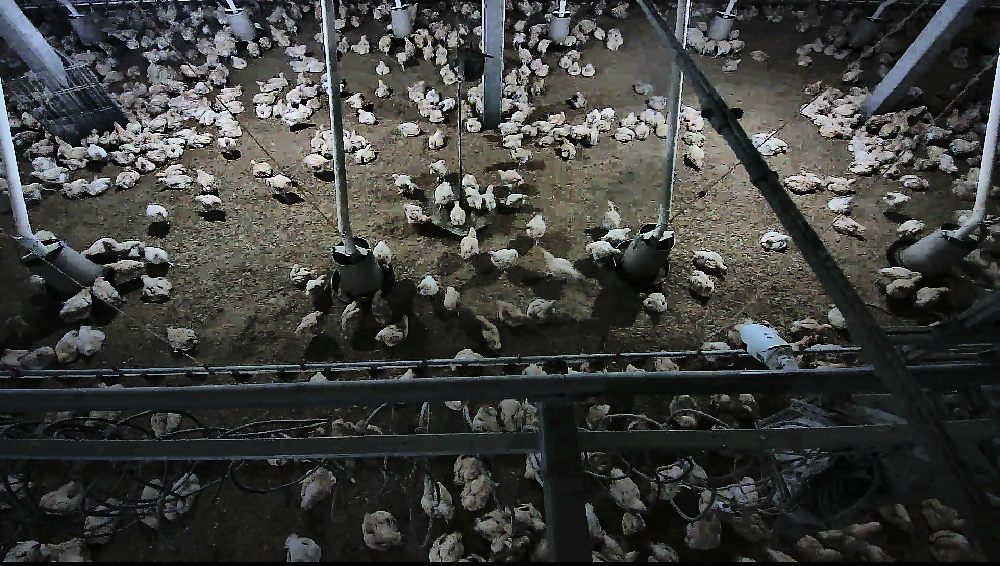
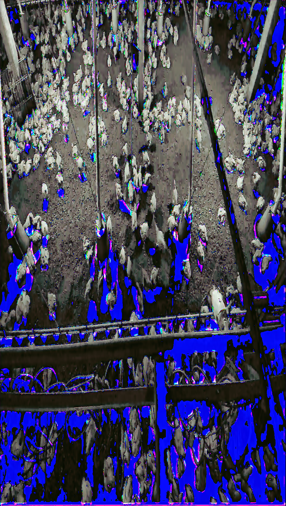
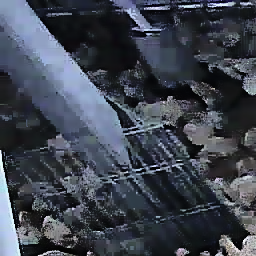
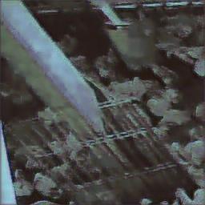
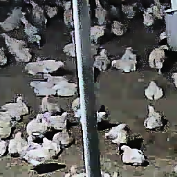
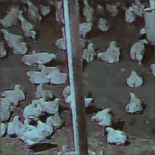
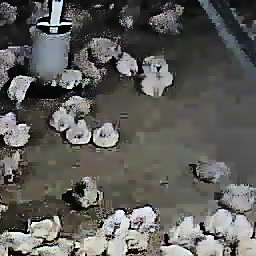
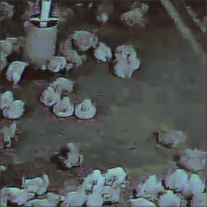

<div align="center">

# Noise2Void 圖像去噪系統
### Image Denoising Using Noise2Void (N2V)

[](https://www.python.org/downloads/)
[](https://www.tensorflow.org/)
[](https://github.com/csbdeep/csbdeep)
[](#硬體需求)
[](LICENSE)
 
**研究員 / 簡報者 (Presenter):** 鄧杰修 (Chieh-Hsiu Teng) |
</div>

---

## 📌 目錄 (Table of Contents)
- [專案簡介 (Overview)](#-專案簡介-overview)
- [技術原理 (Technical Background)](#-技術原理-technical-background)
- [系統架構 (System Architecture)](#-系統架構-system-architecture)
- [環境安裝與快速開始 (Installation & Quickstart)](#-環境安裝與快速開始-installation--quickstart)
- [數據準備 (Data Preparation)](#-數據準備-data-preparation)
- [模型訓練 (Model Training)](#-模型訓練-model-training)
- [預測與結果 (Prediction & Results)](#-預測與結果-prediction--results)
- [目錄結構 (Repository Structure)](#-目錄結構-repository-structure)
- [常見問題與故障排除 (FAQ & Troubleshooting)](#-常見問題與故障排除-faq--troubleshooting)

---

## 🎯 專案簡介 (Overview)

本項目實現 **Noise2Void (N2V)** 深度學習框架，用於無配對數據的自監督圖像去噪。相比傳統去噪方法（如高斯模糊、中值濾波），N2V 可直接從嘈雜圖像學習去噪特徵，無需乾淨參考圖像。

### 核心應用場景
- 醫療影像降噪 (Medical Image Denoising)
- 生物顯微圖像增強 (Microscopy Image Enhancement)
- 工業檢測圖像淨化 (Industrial Inspection Denoising)
- 衛星與遙感圖像去噪 (Satellite & Remote Sensing)

### 主要特點
✅ **無配對訓練** - 無需乾淨的參考圖像  
✅ **GPU 加速** - 原生支持 TensorFlow GPU  
✅ **自適應模型** - 可針對特定圖像類型進行微調  
✅ **高效推理** - 批量處理大規模圖像數據  

---

## 🔬 技術原理 (Technical Background)

### Noise2Void 演算法
Noise2Void (N2V) 是一種自監督學習方法，基於以下假設：

> 相鄰像素具有較強的空間相關性，而噪聲是隨機獨立分布的。

**核心思想：**
1. 輸入帶噪圖像 $I_{noisy}$
2. 網絡預測該像素的值，但**遮蔽相鄰區域**（感受野內的相鄰像素）
3. 通過限制感受野，防止網絡直接複製鄰近的噪聲像素
4. 損失函數僅計算被遮蔽區域的像素，強制網絡學習去噪特性

**數學表述：**

$$\mathcal{L} = \mathbb{E}_{(i,j) \in M} \left\| f(I_{noisy})_{i,j} - I_{noisy,i,j} \right\|^2$$

其中 $M$ 為遮蔽像素集合，$f$ 為網絡。

---

## 🏗️ 系統架構 (System Architecture)

### 工作流程
```
Raw Images
    ↓
Data Loading & Preprocessing (resize to 256×256)
    ↓
Image Normalization
    ↓
Train/Validation Split
    ↓
N2V Model Training (TensorFlow/Keras)
    ↓
Model Checkpointing & Validation
    ↓
Inference on Test Images
    ↓
Denoised Output Images
```

### 網絡架構
- **骨幹網絡**: U-Net (Encoder-Decoder)
- **Encoder**: 卷積塊 + MaxPooling (4層下採樣)
- **Decoder**: 反卷積 + Skip Connections (4層上採樣)
- **特徵通道**: 32 → 64 → 128 → 256 → 128 → 64 → 32
- **輸出層**: 1 或 3 通道 (灰階或彩色圖像)

### 超參數配置
| 參數 | 預設值 | 說明 |
| :--- | :--- | :--- |
| Image Size | 256×256 | 需能被 4 整除 |
| Batch Size | 4-8 | 根據 GPU 記憶體調整 |
| Epochs | 100-200 | 建議監控驗證損失確定停止點 |
| Learning Rate | 0.0004 | Adam 優化器初始學習率 |
| Patch Size | 64 | 訓練時的切片大小 |

---

## 🛠️ 環境安裝與快速開始 (Installation & Quickstart)

### 系統需求
- **OS**: Windows / Linux / macOS
- **Python**: 3.8 ~ 3.10
- **GPU**: CUDA 11.x (推薦使用 GPU)
- **VRAM**: 最少 4GB (推薦 8GB+)

### 安裝步驟

#### 1. 克隆項目
```bash
git clone https://github.com/toolmenj/n2v-denoising.git
cd n2v-denoising
```

#### 2. 創建 Python 虛擬環境
```bash
python -m venv venv
venv\Scripts\activate
```

#### 3. 安裝依賴
```bash
pip install --upgrade pip
pip install -r requirements.txt
```

> **注意**：`n2v` 套件本身（[juglab/n2v](https://github.com/juglab/n2v)）為第三方開源函式庫，並未納入本 repo，由 `requirements.txt` 安裝。

#### 4. 驗證安裝
```bash
python -c "import tensorflow as tf; print('GPU:', tf.config.list_physical_devices('GPU'))"
python -c "from n2v.models import N2V; print('N2V imported successfully')"
```

### 快速開始 (Quickstart)

#### 步驟 1: 準備圖像數據
在 `images/` 文件夾放入待去噪圖像：
```
n2v_生物光機電/
├── images/
│   ├── image_001.png
│   ├── image_002.jpg
│   └── ...
```

#### 步驟 2: 執行預處理
```bash
python cut.py  # 展平嵌套文件夾結構
```

#### 步驟 3: 運行訓練
在 Jupyter Notebook 中執行 `01_training_mydata.ipynb`：
```python
# Cell 1: 導入庫
from n2v.models import N2V, N2VConfig
import tensorflow as tf

# Cell 2: 加載圖像
# Cell 3: 訓練模型
# Cell 4: 進行預測
```

#### 步驟 4: 檢查結果
去噪結果保存在 `output/` 文件夾中。

---

## 📊 數據準備 (Data Preparation)

### 圖像格式支持
- **格式**: PNG, JPG, JPEG, TIF, TIFF
- **色彩空間**: RGB (3通道) 或灰階 (1通道)
- **位深**: 8-bit 或 16-bit

### 預處理流程

#### 1. 尺寸標準化
所有圖像自動調整為 **256×256** 像素（U-Net 要求尺寸能被 4 整除）：

```python
from skimage.transform import resize
resized = resize(img, (256, 256), preserve_range=True, anti_aliasing=True)
```

#### 2. 通道轉換
- 灰階圖 → 擴展為 (H, W, 1)
- 彩色圖 → 保留為 (H, W, 3)
- 非標準格式 → 自動轉置 (C,H,W) 或 (H,C,W) 至 (H,W,C)

#### 3. 正規化
```python
X = normalize(X, 1, 99.8)  # 使用百分位數正規化
```

### 數據統計
```python
print(f"Total images: {len(image_list)}")
print(f"Shape: {X.shape}")  # e.g., (150, 256, 256, 1)
print(f"Min/Max: {X.min():.3f} / {X.max():.3f}")
```

---

## 🎓 模型訓練 (Model Training)

### 訓練配置

```python
from n2v.models import N2V, N2VConfig

# 建立 N2V 配置
config = N2VConfig(
    X=X,
    unet_kern_size=3,
    unet_n_depth=4,
    unet_n_first=32,
    train_steps_per_epoch=20,
    train_epochs=100,
    train_loss='mse',
    batch_norm=True,
    train_batch_size=4,
    n2v_perc_pix=0.198,  # Noise2Void 遮蔽百分比
    n2v_patch_size=64,   # 訓練切片大小
    train_reduce_lr={'factor': 0.5, 'patience': 10, 'min_delta': 0.00001, 'cooldown': 10}
)

# 初始化模型
model = N2V(config=config, name='n2v_model', basedir='models')

# 開始訓練
history = model.train(X, validation_split=0.1)
```

### 訓練監控
- **損失曲線**: 監控訓練與驗證損失
- **Early Stopping**: 驗證損失不再下降時停止
- **Learning Rate 衰減**: 根據驗證損失調整學習率

### 模型保存
訓練完成後，模型自動保存於 `models/n2v_model/` 文件夾：
```
models/n2v_model/
├── config.json
├── weights_best.hdf5
└── logs/
```

---

## 🔮 預測與結果 (Prediction & Results)

### 單張圖像預測

```python
# 加載訓練好的模型
from n2v.models import N2V
model = N2V(config=None, name='n2v_model', basedir='models')

# 讀取待去噪圖像
from skimage.io import imread, imsave
noisy_img = imread('path/to/noisy_image.png')

# 正規化
X_test = normalize(noisy_img, 1, 99.8)

# 預測
denoised = model.predict(X_test, axes='YXC')  # 或 'YX' (灰階)

# 儲存結果
imsave('output/denoised_image.png', denoised)
```

### 批量預測

```python
import os
from skimage.io import imread, imsave

input_dir = 'images/'
output_dir = 'output/'
os.makedirs(output_dir, exist_ok=True)

for fname in os.listdir(input_dir):
    img = imread(os.path.join(input_dir, fname))
    X_test = normalize(img, 1, 99.8)
    denoised = model.predict(X_test, axes='YXC')
    imsave(os.path.join(output_dir, f'denoised_{fname}'), denoised)
```

### 結果評估
| 指標 | 說明 | 計算方法 |
| :--- | :--- | :--- |
| **PSNR** | 峰值信噪比 | $20 \log_{10}(\frac{MAX}{\sqrt{MSE}})$ |
| **SSIM** | 結構相似度 | $\frac{(2\mu_x\mu_y + C_1)(2\sigma_{xy} + C_2)}{(...)}$ |
| **MAE** | 平均絕對誤差 | $\frac{1}{N}\sum \|I_{pred} - I_{ref}\|$ |

### 去噪成果對照 (Sample Results)

完整單張影像（左：原始帶噪；右：N2V 去噪後）：

| 原始 (Noisy) | 去噪後 (Denoised) |
| :---: | :---: |
|  |  |

局部切片對照：

| 原始 (Noisy) | 去噪後 (Denoised) |
| :---: | :---: |
|  |  |
|  |  |
|  |  |

> 完整資料集、實驗輸出與訓練權重因體積因素未納入版本控制，請依上述流程自行訓練產生。

---

## 📁 目錄結構 (Repository Structure)

### 版本控制內容 (Tracked in this repository)
```
n2v-denoising/
├── 01_training_mydata.ipynb           # 主要訓練筆記本
├── 01_training_mydata copy.ipynb      # 備份版本
├── cut.py                             # 圖像資料夾展平工具
├── requirements.txt                   # Python 依賴清單
├── FinalReport.pdf                    # 最終報告
├── keynote.pdf                        # 簡報檔案
├── README.md                          # 本文件
├── LICENSE                            # MIT 授權
└── assets/
    └── samples/                       # 去噪前後對照範例圖
```

### 執行後產生 (Generated locally, git-ignored)
```
├── images/                            # 原始嘈雜圖像（切片後）
├── image/, images_one/                # 其他圖像來源
├── models/                            # 訓練好的模型與 TensorBoard logs
│   └── N2VModel_v*/
│       ├── config.json
│       ├── weights_best.h5
│       └── logs/
├── output/                            # 去噪結果 (預設)
├── output_1/, output_2/, output_3/    # 其他實驗結果
├── output_one/, output_one_2/         # 單圖像實驗輸出
└── n2v/                               # N2V 第三方函式庫本地副本
```

> 以上目錄體積合計約 600 MB，已由 `.gitignore` 排除。

---

## ❓ 常見問題與故障排除 (FAQ & Troubleshooting)

### Q1: 訓練時 GPU 記憶體溢出 (Out of Memory)
**解決方案:**
- 降低 `batch_size` (改為 2 或 1)
- 減少 `unet_n_first` (改為 16)
- 縮小圖像尺寸 (改為 128×128)

```python
config = N2VConfig(
    X=X,
    train_batch_size=2,  # 減少批次
    unet_n_first=16,     # 減少通道數
)
```

### Q2: 訓練損失不下降
**可能原因與解決:**
1. **學習率過高**: 損失振盪
   - 降低初始學習率至 0.0001
2. **數據品質差**: 高噪聲或偽影
   - 檢查輸入圖像質量
   - 嘗試更強的預處理
3. **模型容量不足**: 特徵過於複雜
   - 增加 `unet_n_depth` (改為 5)
   - 增加 `unet_n_first` (改為 64)

### Q3: 預測結果模糊或細節丟失
**原因分析與調整:**
- **模型欠擬合**: 增加訓練 Epochs
- **去噪過度**: 降低訓練步數或調整遮蔽比例
- **網絡結構**: 嘗試不同 `unet_n_depth` (3~5)

### Q4: 如何訓練彩色圖像?
```python
# 確保輸入為 (N, H, W, 3)
config = N2VConfig(X=X)  # 自動偵測通道數
model = N2V(config=config, name='n2v_color', basedir='models')
```

### Q5: 如何在新數據上進行遷移學習?
```python
# 加載預訓練模型
model = N2V(config=None, name='n2v_model', basedir='models')

# 使用新數據微調
history = model.train(X_new, epochs=50)  # 較少訓練回合
```

---

## 📚 參考資源 (References)

### 論文與文獻
- **Noise2Void 原始論文**: [Krull et al., 2019](https://ieeexplore.ieee.org/document/8954066)
  > "Noise2Void - Learning Denoising from Single Noisy Images"
  
- **CSBDeep 框架**: [Weigert et al., 2018](https://arxiv.org/abs/1811.11721)
  > "Content-aware Image Restoration: Pushing the Limits of Fluorescence Microscopy"

### 官方資源
- **N2V GitHub**: https://github.com/csbdeep/csbdeep
- **TensorFlow 官方**: https://www.tensorflow.org/
- **CSBDeep 文檔**: https://csbdeep.biop.ch/

### 相關技術
- U-Net 架構: [Ronneberger et al., 2015](https://arxiv.org/abs/1505.04597)
- 自監督學習: [Jing & Tian, 2020](https://arxiv.org/abs/1906.02940)

---

## 📄 授權 (License)

本項目採用 **MIT License** 授權。詳見 [LICENSE](LICENSE) 文件。

---


**最後更新 (Last Updated)**: 2025-08-13  
**版本 (Version)**: 1.0.0

